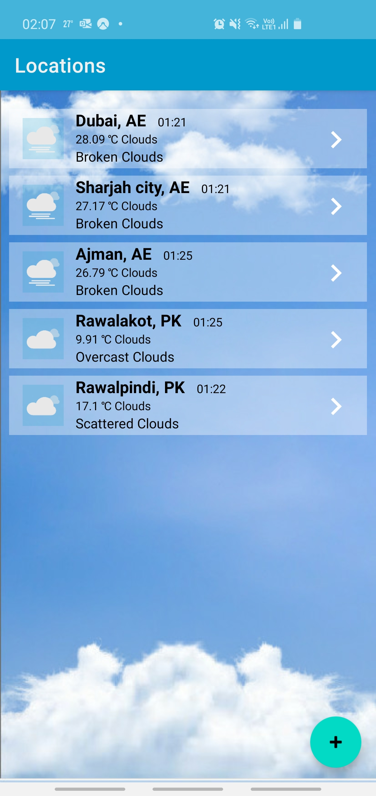
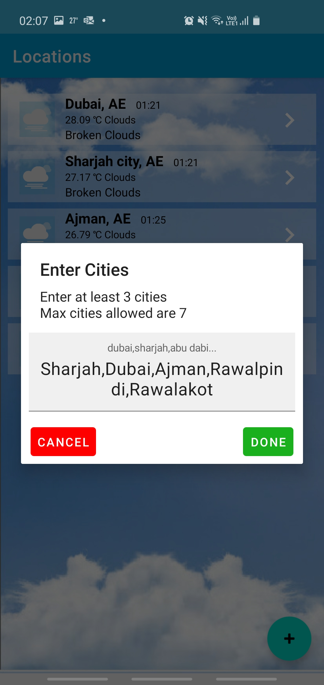
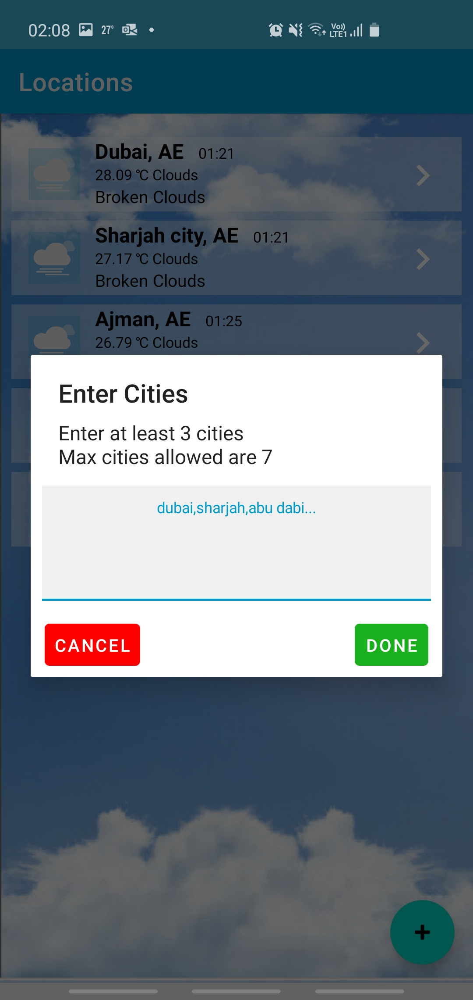
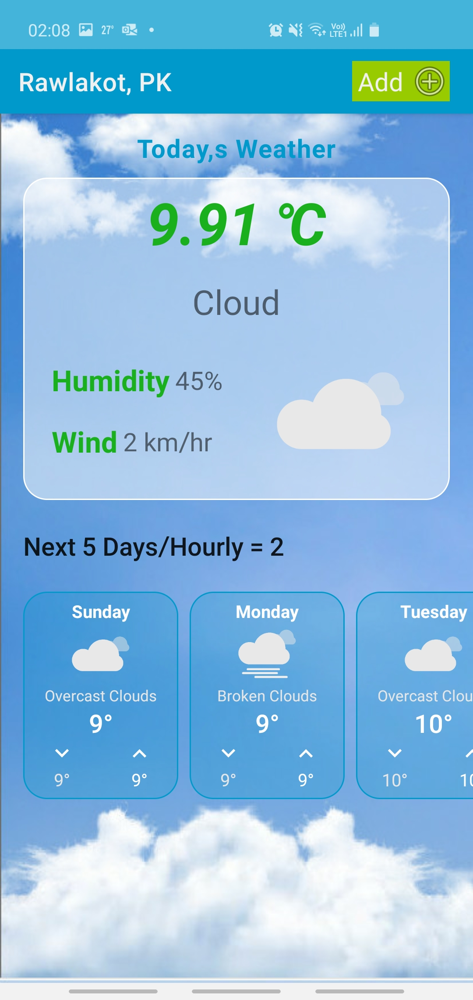

# Weather Forecast &mdash; the Sample App for Android

This is a sample app developed using https://openweathermap.org/ weather API. 

## About Weather Forecast

Weather Forecast is a Mobile App that allow user to add mutiple cities for weather data. User can add minum 3 and maximum 7 cities.

App will fatch the flowing data
 
 1. Temprature(Min and Max),
 2. Weather Discription
 3. Wind speed
 
 
 
 5 day forecast is available at any location or city. It includes weather data every 3 hours. Means Api return 40 records in total.
 each per 3 hours. 
 
 
 ## Getting Started

### Clone the Repository

As usual, you get started by cloning the project to your local machine:

```
$ git clone https://github.com/umerjavaidkh/Weather_Forecast.git
```

## <a name="gradle"></a>Building with Gradle

0. Build the sample app using:

  ```
  ./gradlew clean build`
  ```
0. To see a list of available tasks, execute:

  ```
  ./gradlew tasks
  ```
  
  
  ## Run Complete App Journey
  
  
  1. Navigate to androidTest
  2. Open com.android.weatherforecast AppJourney
  3. Run -> AppJourney
  
## Run Coverage Report
   1. Navigate to Test
   2. Open com.android.weatherforecast.ui.selection_activity CurrentViewModelViewModelTest
   3. Run -> CurrentViewModelViewModelTest with  Coverage Report Option
   
   
  
   
   
   
    
     
      
   

